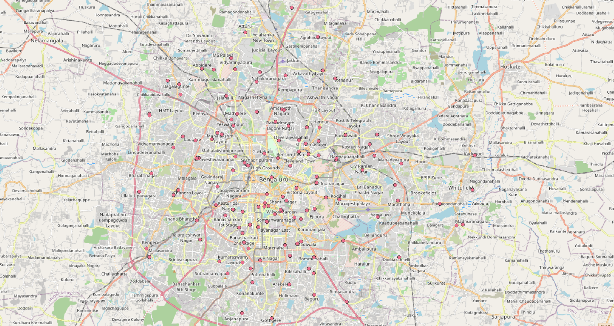

# Karnataka Health Spatial Data

### Source

Data on this repository has been scraped/sourced from:

- Karnataka: [KSRSAC](https://ksrsac.karnataka.gov.in/)

### Data

Available for the following features:
- Location:
  - Urban Primary Health Center (Bengaluru only)
  - Anganwadi
  - Polio Immunization Center
- Boundaries:
  - Primary Health Center
  - Community Health Center
  - Sub Center
  - Taluk Hospital
