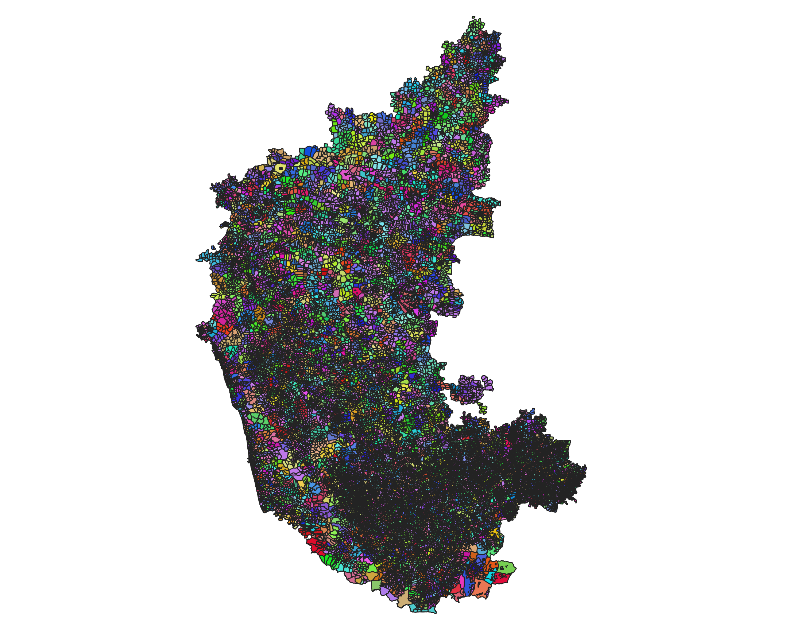

# Karnataka Social Services Data

*Karnataka Primary Health Center Boundaries*

### Source

Data on this repository has been gratefully scraped from:

- [KSRSAC](https://ksrsac.karnataka.gov.in/)
- [KGIS](https://kgis.ksrsac.in/kgis1/portal.aspx)

### Data

Available for the following features:

- BBMP
  - Bangalore One
  - Dry Waste Collection Center
  - Indira Canteen
  - Park
  - Playground
  - Toilet
  - Ward Office
  - Zone Office
- BESCOM
  - ATP Counter
  - BESCOM Office
  - Boundary
- BWSSB
  - Boundary
  - Ground Level Reservoir
  - Kiosk
  - Over Head Tank
  - Sewage Treatment Plant
  - Sewer Line
  - Water Line
- Education
  - Boundary
  - Higher Education
    - College (Degree/Engineering)
    - Polytechnic Institute
    - Teacher Education Institution
    - University
  - Primary/Secondary Education
    - PUC
    - School
- Health
  - Anganwadi
  - Blood Bank/Storage Center
  - Boundary
  - Medical Shop/Pharmacy
  - Health and Family Welfare (Hospital/Center/Lab)
  - Immunization
  - KSAPS (Karnataka State AIDS Prevention Society)
  - Medical Education
  - Tuberculosis Center
  - UPHC
